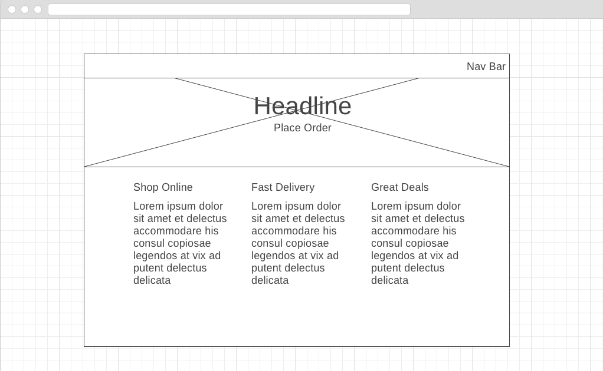
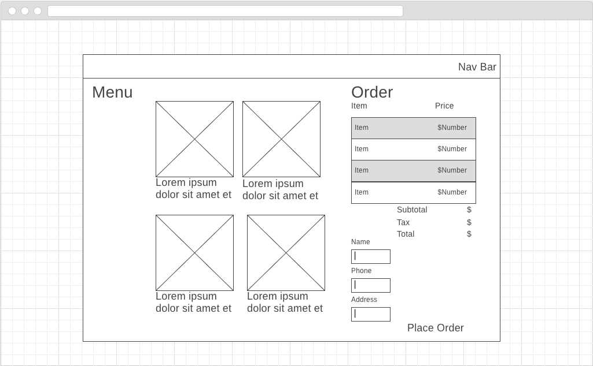

# Galvanize Eats

This site contains two pages. The home page contains information on Galvanize Eats. The order page allows the user to pick items from the menu, add their quantity of said items, input their name, telephone number, and address to deliver an order. When the submission has been made to the API, the user receives clarification that it has been sent.  will host future projects. It contains links to other pages within the site along with some fun information about myself. 

## Website URL: 

http://justcallmebeef-gdelivers.surge.sh/index.html

### Technologies 

HTML, CSS, Materialize, Flexbox, and Javascript 

### Wireframes

### 

## Author

* **Bethany Mitch** - *BM* - [justcallmebeef](https://github.com/justcallmebeef)